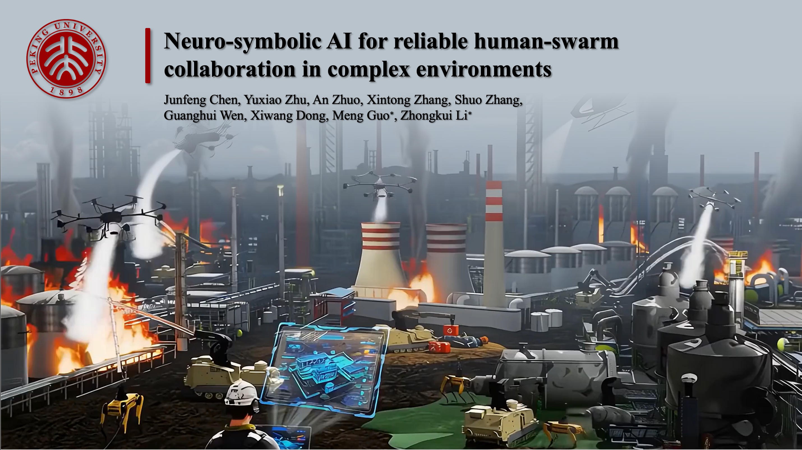

# Neuro-symbolic AI for reliable human-swarm collaboration in complex environments 🚀🤖

## Abstract

Robot swarms promise scalable assistance in complex and hazardous environments.
Task planning lies at the core of human–swarm collaboration, translating the operator’s intent into
coordinated swarm actions and helping determine when validation or intervention is required
during execution. In long-horizon missions under dynamic scenarios, however, reliable task
planning becomes difficult to maintain: emerging events and changing conditions demand
continual adaptation, and sustained operator oversight imposes substantial cognitive burden.
Existing LLM-based planning tools can support plan generation, yet they remain susceptible to
invalid task orderings and infeasible robot actions, resulting in frequent manual adjustment. Here
we introduce a neuro-symbolic framework for long-horizon human-swarm collaboration that
tightly couples verifiable task planning with context-grounded LLM reasoning. We formalize
mission goals and operational rules as temporal logic formulas and admissible task orderings as
task automata. Conditioned on these formal constraints and live perceptual context, LLMs
generate executable subtask sequences that satisfy mission rules and remain grounded in the
current scene. An uncertainty-aware scheduler then assigns subtasks across the heterogeneous
swarm to maximize parallelisms while remaining resilient to disruptions. An event-triggered
interaction protocol further limits operator involvement to sparse, high-level confirmation and
guidance. In large-scale simulations with more than 40 robots executing 41 tasks with 155
subtasks in 11-minute missions, our system improves task success rates by 26% and increases
completed tasks by 132% relative to state-of-the-art baselines. At the same time, it reduces
operator interventions by 77% and lowers physiological stress by 49%. Deployment on a
heterogeneous robotic fleet yields similar results while remaining robust to hardware-specific
actuation and communication uncertainties. Together, these results support a formal and scalable
paradigm for reliable and low-overhead human–swarm collaboration in dynamic environments.

## Code

Code Coming Soon!

## Contact

- [Junfeng Chen](mailto:chenjunfeng@stu.pku.edu.cn)
- [Yuxiao Zhu](mailto:yuxiao.zhu@dukekunshan.edu.cn)
- [Meng Guo](mailto:meng.guo@pku.edu.cn)
